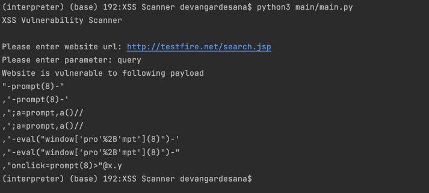

# Reflected XSS Vulnerability Scanner.

---
## What is a reflected XSS attack.

---

Reflected XSS attack, also known as non-persistent 
attacks, occur when a malicious script is reflected 
off of a web application to the victim's browser.

The script can be activated through a link, 
which sends a request to a website with a vulnerability, 
that enables execution of malicious scripts. 
The vulnerability is usually a result of incoming 
requests not being sufficiently sanitized, 
which allows us for the manipulation of a web 
application's functions and the activation of 
malicious scripts.

## Reflected XSS Tool Work Flow.

---
This tool is an intelligent tool that make use of 
human techniques to look for reflected cross-site 
scripting (XSS) Vulnerabilities.

It accepts two parameters, one is a URL and other is 
query parameter.
Then, it executes the URL provided by appending number
of various malicious payloads as a query parameter
to check that if the URL entered is vulnerable to XSS 
attack or not.

If there is any payload present in the page source code
than it highlights and provide that in the output
after verifying.

## How to use

---
Run `git clone https://github.com/ethicalhacker4sec/vulnerabilityscanner.git` and setup the code in your pc.

- Navigate to the project path `cd vulnerabilityscanner/`
- Install dependencies using `pip3 install -r requirements.txt`.
- Execute the command to start scanner `python3 main/main.py` as shown in the image

